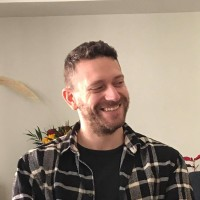

# impact-assessment-tutorial

## Description

## Impact Assessment in Scientific Knowledge Graphs

## Tutorial Material

## Presenters

### Thanasis Vergoulis 
Thanasis Vergoulis is a Scientific Associate at IMSI, Athena Research Center in Greece. He received his diploma in Computer Engineering and Informatics from the Univ. 
of Patras and his PhD in Computer Science from NTU of Athens, under the supervision of Prof. Timos Sellis. He has been involved in several EU and national ICT projects 
related to big data, scientific data management, open science, and linked data. His research interests also involve bioinformatics, text mining & information retrieval 
for scientific publications, and research analytics. He has served as a member of the program or organizing committee for several CS conferences and as a reviewer for 
several top-tier journals. Finally, he has been teaching courses in undergraduate and postgraduate level in academic institutions in Greece and Cyprus.

### Dimitris Sacharidis 
Dimitris Sacharidis is an assistant professor at the Web and Information Technologies lab at the Université Libre De Bruxelles (ULB). Prior to that he was an assistant 
professor at the Technical University of Vienna, and a Marie Skłodowska Curie fellow at the “Athena” Research Center and at the Hong Kong University of Science and Technology. 
He has a Diploma and a PhD in Computer Engineering from the National Technical University of Athens, and a MSc in Computer Science from the University of Southern California.
In his research, he is interested in topics related to data science and data engineering.

### Ilias Kanellos
 Ilias Kanellos is a Scientific Associate at IMSI - "Athena" RC. He received his diploma in Electrical and Computer Engineering from the NTU of Athens in 2012. He then
completed his PhD at the school of Electrical and Computer Engineering, NTU Athens, in 2020. He has been involved in several EU and national R&D projects and his 
research interests include research analytics, scientific data management, cloud computing, bioinformatics, and data mining. He has co-authored 18 articles in Scientific
Journals and Conferences.
